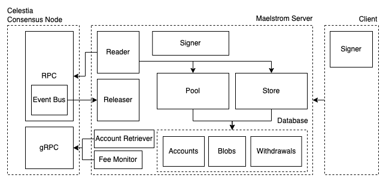

# Maelstrom 🌊

_This project is currently under construction and not ready for production_

Maelstrom is a trusted blob aggregator for [Celestia](http://celestia.org). Rollups simply embed the maelstrom client for blob submission and benefit from:

- Cheaper per byte data availablity through batching
- More fine-grained transaction control
- Simpler usage patterns
- Better pricing estimation and handling of the transaction from submission to finalization

If you wish to understand the background story and the rationale behind this project, please read the [rationale](#rationale) section. If you're already up to speed and want to understand Maelstrom's architecture, jump to the [how does it work?](#how-does-it-work) section. If you're simply interested in seeing it in action, jump to the [getting started](#getting-started) section.

## Rationale

Sequencers originated from the inception of rollups: a machine that was needed to receive transactions, validate them, bundle them together and submit them to the underlying data availability layer (like Celestia or Ethereum).

This single machine really has two roles. One for handling transactions prior to being finalized and a second for executing those transactions after the DA layer has published them. A rollup network may better suited to splitting up into one sequencer and one or more processor who would execute the transcations, producing proofs if needed.

This new sequencer role could be outsourced as a separate service especially as it does not rely on understanding the state of the rollup. Moreso, there could be greater efficiency gains if multiple rollups were to share the same sequencer. This gave birth to the idea of a shared sequencer.

Relying on a shared sequencer means your rollup system needs to be aware of another point of failure. Not only could the shared sequencer crash, but it may also become incentivised to censor certain transactions. To overcome this some shared sequencers have looked to become decentralized through a similar proof of stake system as the underlying DA layers.

This however further increases the cost of publishing data. Now one has to pay all the validators of the DA layer and all the validators of the shared sequencer. This isn't the only path nor does it seem like the best. Instead, we can remove the given privelege of the shared sequencer and have a permissionless setup where multiple shared sequencers can compete for quality of service. Furthermore, if all shared sequencers are censoring, a permissionless model also allows for users to submit their transactions directly to the DA layer.

This is the model that Maelstrom advocates. It is trusted, not decentralized, relying on reputation, competition and choice to ensure that the best service is provided.

## How does it work?

Maelstrom has both a server and client which talk to one another over gRPC. The server, in turn, talks directly with a running Celestia node. The server has it's own account system which keeps track of payments to an on-chain Celestia account and authorizes withdrawals from that account. This funds the data that the client submits to the server. There are three categories of usage: depositing, blob submission and withdrawal.

### Deposit

To intiate a balance, users must send money from their on-chain account to maelstrom's on-chain address. Any method works as the server's `Reader` reads all transactions committed in a block. For convenience, the client provides a method. The server tracks the senders address. The public key of that account is used later to authorize blob submission and withdrawals.

```go
func (c *Client) Deposit(ctx context.Context, coins uint64) error

func (c *Client) Balance(ctx context.Context) (uint64, error)
```

The client can also be used to monitor the users balance.

### Blob Submission

One or more blobs can be submitted to a namespace. So long as the user has sufficient funds and the fee is greater than the minimum fee, the blob will be accepted by the server. Each height, the server will assess whether it has enough blobs and the collective funds to pay for submitting the transaction. Blobs will remain in the pool until they are either committed, cancelled or expire (after n blocks). For the later two, the user will be refunded the fee. The user must sign each transaction with the private key of the account that has the funds. This is all done automatically by the client.

```go
func (c *Client) Submit(ctx context.Context, namespace []byte, blobs [][]byte, fee uint64) (uint64, error)

func (c *Client) Cancel(ctx context.Context, id uint64) error

func (c *Client) Confirm(ctx context.Context, id uint64) ([]byte, error)
```

The server has built-in replay protection which prevents the same blobs from being submitted multiple times to the same namespace. The blobs themselves are purely in-memory. If the server crashes they are lost however all transfers of funds and receipts are stored on disk and can be recovered and refunded to the user.

### Withdrawal

The user does not need to spend all the funds allocated. They may simply withdraw some or all of the balance back to their on-chain account. Each withdrawal incures a fixed fee to cover the gas. Withdrawals are made without any delay to the user. Similarly to blob submission, the user must sign the transaction with the private key of the account that has the funds. Withdrawals also have replay protection to avoid the same withdrawal being submitted multiple times. The function blocks until the server confirms that the withdrawal has been committed on-chain.

```go
func (c *Client) Withdraw(ctx context.Context, amount uint64)

func (c *Client) WithdrawAll(ctx context.Context) error
```

### Architecture

Below is a rough schematic of the system architecture. Each maelstrom instance is coupled with a Celestia consensus node which the server talks to via RPC for block queries, gRPC for state queries and gas estimation and the event bus for the releaser. The releaser is designed to work out the optimal time to submit a transaction that will still make it in the next block.



The reader safely and sequentially processes every transaction ensure none is ever missed. It is used for process deposits but also for confirming successful blob submissions and withdrawals. At the end of processing each height, the reader also updates the pool which will timeout any blobs or transactions that have expired.

## Getting Started

Maelstrom is currently not yet deployed however it can be run locally.

1. Clone the repository and `cd` into it.
2. Run `make testnet` to spin up a single node local Celestia testnet. You will see the node's file system under the `temp` directory in the repo.
3. In another terminal, run `bash ./scripts/init.sh`. This will initialize both the client and server directories in the same `temp` folder. You should see the following output:

```text
Installing maelstrom server...
Installing maelstrom client...
Initializing maelstrom server...
created new keyring with account celestia1hpaq5v5ckzrecw3t995jrljrdsympkzzgg4yqp and with mnemonic:
mystery goose saddle involve disease sock state pond reflect myth scorpion super repair ride imitate mistake fashion stamp term behave cruel message secret century
Starting maelstrom client...
created new account with mnemonic: select glass deposit nominee document shift radio govern dad ritual jazz lecture mix present catch pitch legal service short bike auto pave area cable
created keyring with address: celestia1kyueucxy6cd2zw3qg3hhkydtm6w3gfvr9g2mkt
```

4. Fund the maelstrom server account with some coins by calling `bash ./scripts/fund.sh` followed by the address printed out above (in this case celestia1hpaq5v5ckzrecw3t995jrljrdsympkzzgg4yqp).
5. Do the same for the client account.
6. `cd temp/server` and run `ms start`. This will start the server. You should see the logs output each block.
7. Open a third terminal and `cd temp/client`. Run `maelstrom balance --celestia`, to see that the account has been correctly funded.
8. Now run `maelstrom deposit 9000000` to transfer funds to your maelstrom account. You can double check once it's complete by running `maelstrom balance`.
9. To submit a blob, run `maelstrom submit maelstrom "hello world" 100000`. This will submit the blob `"hello world"` to the namespace `maelstrom` with a fee of 100000. You should observe the following output:

```text
Submitted blob to namespace
Blob committed (tx hash 11BF260162A52B8EA769CDB956F0676462A7292CA09213534C057B68DA5344AD)
```

Congrats! you've submitted a blob. If you want you can use the tx hash to query the transaction and confirm that the blob is there.
